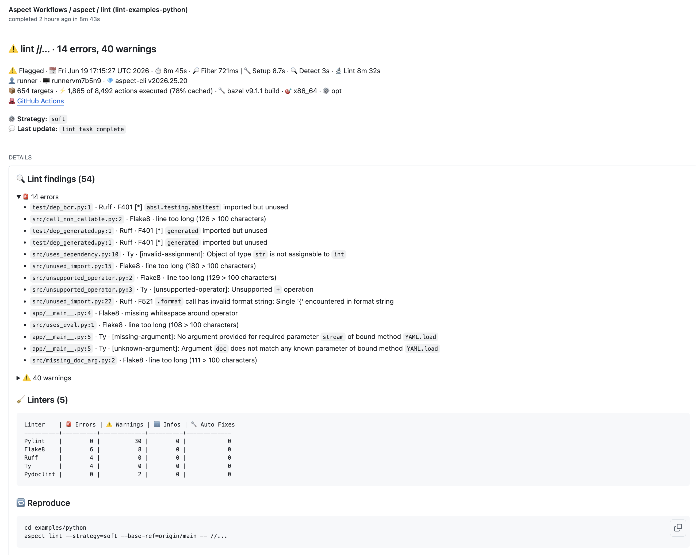

# Run linters and formatters under Bazel

> [!NOTE]
> This repository uses the [Aspect CLI](https://github.com/aspect-build/aspect-cli) for CI and local development.
> See the [docs](https://docs.aspect.build/cli/overview) and [install instructions](https://docs.aspect.build/cli/install) to get started.

This ruleset integrates linting and formatting as first-class concepts under Bazel.

Features:

- **No changes needed to rulesets**. Works with the Bazel rules you already use.
- **No changes needed to BUILD files**. You don't need to add lint wrapper macros, and lint doesn't appear in `bazel query` output.
  Instead, users simply lint their existing `*_library` targets.
- **Incremental**. Lint checks (including producing fixes) are run as normal Bazel actions, which means they support Remote Execution and the outputs are stored in the Remote Cache.
- Lint results can be **presented in various ways**, such as Code Review comments or failing tests.
  See [Usage](https://github.com/aspect-build/rules_lint/blob/main/docs/linting.md#usage).
- **Can lint changes only**. It's fine if your repository has a lot of existing issues.
  It's not necessary to fix or suppress all of them to start linting new changes.
  This is sometimes called the "Water Leak Principle": you should always fix a leak before mopping the spill.
- **Can format files not known to Bazel**. Formatting just runs directly on the file tree.
  No need to create `sh_library` targets for your shell scripts, for example.
- Honors the same **configuration files** you use for these tools outside Bazel (e.g. in the editor)

**Watch Alex's talk at BazelCon 2024:**

[](https://www.youtube.com/watch?v=CnK-RAdfrpI)

## Better DX with the Aspect CLI

You _can_ drive linting straight from Bazel, but the experience is rough: you
run a verbose build to produce report files, then hunt them down under
`bazel-out/` and `cat` them yourself.

```console
$ bazel build --config=lint --output_groups=rules_lint_human //...
INFO: Build completed successfully, 8 total actions
# ...no findings printed. Now go find and cat the reports:
$ cat bazel-out/*/bin/src/hello.AspectRulesLintShellCheck.out
In src/hello.sh line 10:
grep '*foo*' file
     ^-----^ SC2063 (warning): Grep uses regex, but this looks like a glob.
```

The [Aspect CLI](https://github.com/aspect-build/aspect-cli) adds a first-class
`aspect lint` command that runs the same Bazel aspects, then collects and prints
every finding for you — grouped by linter, tagged by severity, with `file:line`
and rule, and one-key interactive fixes:

```console
$ aspect lint //...

🧹 Linters (1): ShellCheck

Lint findings
  ℹ️ src/hello.sh:4 · ShellCheck — Double quote to prevent globbing and word splitting.
  ⚠️ src/hello.sh:10 · ShellCheck — Grep uses regex, but this looks like a glob.
```

It also scopes findings to your changed lines by default (the "Water Leak
Principle") and applies fixes with `aspect lint --fix`.

On CI, the **free [Aspect Workflows GitHub App](https://aspect.build/docs/cli/authentication)**
makes this shine: every `aspect lint` task posts a rich GitHub **status check**
— findings grouped by linter and severity with `file:line` and rule, a
per-linter summary table, and a copy-paste reproduce command — and surfaces the
same findings as inline PR review comments. Install and authenticate it in a few
minutes; no server to run.

[](https://github.com/aspect-build/rules_lint/pull/920/checks?check_run_id=82394567739)

> The screenshot above is a live status check from this repo's `examples/python`
> lint task — [open the real thing](https://github.com/aspect-build/rules_lint/pull/920/checks?check_run_id=82394567739).

Configure it once in `.aspect/config.axl` by pointing the `lint` task at your
aspects — no `--config=lint` or output-group flags to remember:

```python
def config(ctx: ConfigContext):
    ctx.tasks["lint"].args.aspects = ["//tools/lint:linters.bzl%shellcheck"]
```

**Try it in this repo:** every linter under [`examples/`](./examples) is wired
up for `aspect lint`. After [installing the CLI](https://docs.aspect.build/cli/install):

```console
$ cd examples/shell && aspect lint //...
```

### Formatting

The same applies to formatting. Instead of `bazel run //tools/format`, the
`aspect format` command runs your `//tools/format` target, formats only your
changed files by default (or `--scope=all` for the whole tree), and reports
exactly what it touched — with a ready-to-run fix command:

```console
$ aspect format

→ ✨ Format · Formatting changed files
→ 📋 Diff · Computing format diff
2 files were modified:
  - src/hello.sh
  - src/sourced_dep.sh
```

On CI it posts a **format status check** via the same GitHub App, and
`--severity` chooses whether an unformatted file warns or fails the build. It
works out of the box — `aspect format` already targets `//tools/format`, so no
extra config is needed:

```console
$ cd examples/shell && aspect format
```

See the [Aspect CLI overview](https://docs.aspect.build/cli/overview) and the
[`lint`](https://docs.aspect.build/cli/lint) and
[`format`](https://docs.aspect.build/cli/format) task docs.

## Supported tools

New tools are being added frequently, so check this page again!

Linters which are not language-specific:

- [keep-sorted]

| Language               | Formatter                 | Linter(s)                                               |
| ---------------------- | ------------------------- | ------------------------------------------------------- |
| C / C++                | [clang-format]            | [clang-tidy] or [cppcheck]                              |
| CUE                    | [cue fmt]                 |                                                         |
| Cuda                   | [clang-format]            |                                                         |
| CSS, Less, Sass        | [Prettier]                | [Stylelint]                                             |
| F#                     | [Fantomas]                |                                                         |
| Go                     | [gofmt] or [gofumpt]      |                                                         |
| Go Module              | [modfmt]                  |                                                         |
| Gherkin                | [prettier-plugin-gherkin] |                                                         |
| GraphQL                | [Prettier]                |                                                         |
| HCL (Hashicorp Config) | [terraform] fmt           |                                                         |
| HTML                   | [Prettier]                |                                                         |
| JSON                   | [Prettier]                |                                                         |
| Java                   | [google-java-format]      | [pmd] , [Checkstyle], [Spotbugs]                        |
| JavaScript             | [Prettier]                | [ESLint]                                                |
| HTML templates         | [djlint]                  |                                                         |
| Jsonnet                | [jsonnetfmt]              |                                                         |
| Kotlin                 | [ktfmt]                   | [ktlint]                                                |
| Markdown               | [Prettier]                | [Vale]                                                  |
| Pkl                    | [pkl]                     |                                                         |
| PowerShell             |                           | [PSScriptAnalyzer]                                      |
| Protocol Buffer        | [buf]                     | [buf lint]                                              |
| Python                 | [ruff]                    | [bandit], [flake8], [pydoclint], [pylint], [ruff], [ty] |
| QML                    | [qmlformat]               | [qmllint]                                               |
| Ruby                   |                           | [RuboCop], [Standard]                                   |
| Rust                   | [rustfmt]                 | [clippy]                                                |
| SQL                    | [prettier-plugin-sql]     |                                                         |
| Scala                  | [scalafmt]                |                                                         |
| Shell                  | [shfmt]                   | [shellcheck]                                            |
| Starlark               | [Buildifier]              | [Buildifier]                                            |
| Swift                  | [SwiftFormat] (1)         |                                                         |
| TOML                   | [taplo]                   |                                                         |
| TSX                    | [Prettier]                | [ESLint]                                                |
| TypeScript             | [Prettier]                | [ESLint]                                                |
| YAML                   | [yamlfmt]                 | [yamllint]                                              |
| XML                    | [prettier/plugin-xml]     |                                                         |

[prettier]: https://prettier.io
[google-java-format]: https://github.com/google/google-java-format
[bandit]: https://bandit.readthedocs.io/en/latest/
[Fantomas]: https://fsprojects.github.io/fantomas/
[flake8]: https://flake8.pycqa.org/en/latest/index.html
[pydoclint]: https://jsh9.github.io/pydoclint/
[pmd]: https://docs.pmd-code.org/latest/index.html
[checkstyle]: https://checkstyle.sourceforge.io/cmdline.html
[spotbugs]: https://spotbugs.github.io/
[buf lint]: https://buf.build/docs/lint/overview
[eslint]: https://eslint.org/
[swiftformat]: https://github.com/nicklockwood/SwiftFormat
[terraform]: https://github.com/hashicorp/terraform
[buf]: https://docs.buf.build/format/usage
[keep-sorted]: https://github.com/google/keep-sorted
[ktfmt]: https://github.com/facebook/ktfmt
[ktlint]: https://github.com/pinterest/ktlint
[buildifier]: https://github.com/keith/buildifier-prebuilt
[djlint]: https://djlint.com/
[pkl]: https://pkl-lang.org/index.html
[prettier-plugin-sql]: https://github.com/un-ts/prettier
[prettier-plugin-gherkin]: https://github.com/mapado/prettier-plugin-gherkin
[prettier/plugin-xml]: https://github.com/prettier/plugin-xml
[gofmt]: https://pkg.go.dev/cmd/gofmt
[gofumpt]: https://github.com/mvdan/gofumpt
[modfmt]: https://github.com/joshdk/modfmt
[jsonnetfmt]: https://github.com/google/go-jsonnet
[scalafmt]: https://scalameta.org/scalafmt
[rubocop]: https://docs.rubocop.org/
[standard]: https://github.com/standardrb/standard
[ruff]: https://docs.astral.sh/ruff/
[ty]: https://docs.astral.sh/ty/
[pylint]: https://pylint.readthedocs.io/en/stable/
[qmlformat]: https://doc.qt.io/qt-6/qtqml-tooling-qmlformat.html
[qmllint]: https://doc.qt.io/qt-6/qtqml-tooling-qmllint.html
[shellcheck]: https://www.shellcheck.net/
[shfmt]: https://github.com/mvdan/sh
[taplo]: https://taplo.tamasfe.dev/
[clang-format]: https://clang.llvm.org/docs/ClangFormat.html
[clang-tidy]: https://clang.llvm.org/extra/clang-tidy/
[cue fmt]: https://cuelang.org/docs/reference/command/cue-help-fmt/
[cppcheck]: https://www.cppcheck.com/
[vale]: https://vale.sh/
[yamlfmt]: https://github.com/google/yamlfmt
[yamllint]: https://yamllint.readthedocs.io/en/stable/
[psscriptanalyzer]: https://github.com/PowerShell/PSScriptAnalyzer
[rustfmt]: https://rust-lang.github.io/rustfmt
[stylelint]: https://stylelint.io
[clippy]: https://github.com/rust-lang/rust-clippy

1. Non-hermetic: requires that a swift toolchain is installed on the machine.
   See https://github.com/bazelbuild/rules_swift#1-install-swift

To add a tool, please follow the steps in [lint/README.md](./lint/README.md) or [format/README.md](./format/README.md)
and then send us a PR.
Thanks!!

## Installation

Follow instructions from the release you wish to use:
<https://github.com/aspect-build/rules_lint/releases>

## Usage

Formatting and Linting are inherently different, which leads to differences in how they are used in rules_lint. It is best conceived as two rulesets in one.

| Formatter                                                         | Linter                                                 |
| ----------------------------------------------------------------- | ------------------------------------------------------ |
| Only one per language, since they could conflict with each other. | Many per language is fine; results compose.            |
| Invariant: program's behavior is never changed.                   | Suggested fixes may change behavior.                   |
| Developer has no choices. Always blindly accept result.           | Fix may be manual, or select from multiple auto-fixes. |
| Changes must be applied.                                          | Violations can be suppressed.                          |
| Operates on a single file at a time.                              | Can require the dependency graph.                      |
| Can always format just changed files / regions                    | New violations might be introduced in unchanged files. |
| Fast enough to put in a pre-commit workflow.                      | Some are slow.                                         |

### Format

To format files, run the target you create when you install rules_lint.

We recommend using a Git pre-commit hook to format changed files, and [Aspect Workflows] to provide the check on CI.

See [Formatting](./docs/formatting.md) for more ways to use the formatter.

Also see [API Documentation](https://registry.bazel.build/docs/aspect_rules_lint#format-defs-bzl)

Demo:


### Lint

To lint code, we recommend using the [Aspect CLI] to get the missing `lint` command, and [Aspect Workflows] to provide first-class support for "linters as code reviewers".

For example, running `bazel lint //src:all` prints lint warnings to the terminal for all targets in the `//src` package.
Suggested fixes from the linter tools are presented interactively.

See [Linting](./docs/linting.md) for more ways to use the linter.

Also see [API Documentation](https://registry.bazel.build/docs/aspect_rules_lint)

Demo:


### Ignoring files

The linters only visit files that are part of the Bazel dependency graph (listed as `srcs` to some library target).

The formatter honors the `.gitignore` and `.gitattributes` files.
Otherwise use the affordance provided by the tool, for example `.prettierignore` for files to be ignored by Prettier.

Sometimes engineers want to ignore a file with a certain extension because the content isn't actually valid syntax for the corresponding language.
For example, you might write a template for YAML and name it `my-template.yaml` even though it needs to have some interpolated values inserted before it's syntactically valid.
We recommend instead fixing the file extension. In this example, `my.yaml.tmpl` or `my-template.yaml_` might be better.

### Using with your editor

We believe that existing editor plugins should just work as-is. They may download or bundle their own
copy of the tools, which can lead to some version skew in lint/format rules.

For formatting, we believe it's a waste of time to configure these in the editor, because developers
should just rely on formatting happening when they commit and not care what the code looks like before that point.
But we're not trying to stop anyone, either!

You could probably configure the editor to always run the same Bazel command, any time a file is changed.
Instructions to do this are out-of-scope for this repo, particularly since they have to be formulated and updated for so many editors.

[aspect workflows]: https://docs.aspect.build/workflows
[aspect cli]: https://docs.aspect.build/cli

# Telemetry & privacy policy

This ruleset collects limited usage data via [`tools_telemetry`](https://github.com/aspect-build/tools_telemetry), which is reported to Aspect Build Inc and governed by our [privacy policy](https://www.aspect.build/privacy-policy).
