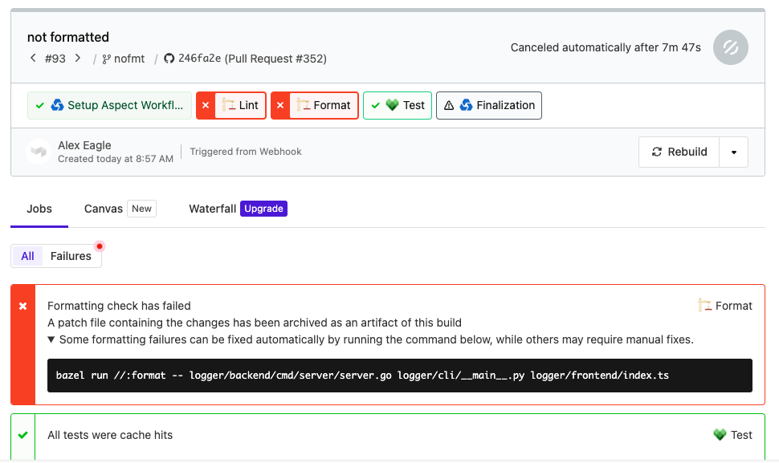

# Formatting

## Installation

Create a BUILD file that declares the formatter binary, typically at `tools/format/BUILD.bazel`

This file contains a `format_multirun` rule. To use the tools supplied by default in rules_lint,
just make a simple call to it like so:

```starlark
load("@aspect_rules_lint//format:defs.bzl", "format_multirun")

format_multirun(name = "format")
```

For more details, see the `format_multirun` [API documentation](./format.md) and
the `example/tools/format/BUILD.bazel` file.

Finally, we recommend an alias in the root BUILD file, so that developers can just type `bazel run format`:

```starlark
alias(
    name = "format",
    actual = "//tools/format",
)
```

### Choosing formatter tools

Each formatter should be installed by Bazel. A formatter is just an executable target.

`rules_lint` provides some default tools at specific versions using
[rules_multitool](https://github.com/theoremlp/rules_multitool).
You may fetch alternate tools or versions instead.

To register the tools you fetch, supply them as values for that language attribute.

For example:

```starlark
load("@aspect_rules_lint//format:defs.bzl", "format_multirun")

format_multirun(
    name = "format",
    python = ":ruff",
)
```

## Usage

### Configuring formatters

Since the `format` target is a `bazel run` command, it already runs in the working directory alongside the sources.
Therefore the configuration instructions for the formatting tool should work as-is.
Whatever configuration files the formatter normally discovers will be used under Bazel as well.

As an example, if you want to change the indent level for Shell formatting, you can follow the
[instructions for shfmt](https://github.com/mvdan/sh/blob/master/cmd/shfmt/shfmt.1.scd#examples) and create a `.editorconfig` file: 

```
[[shell]]
indent_style = space
indent_size = 4
```

### One-time re-format all files

Assuming you installed with the typical layout:

`bazel run //:format`

> Note that mass-reformatting can be disruptive in an active repo.
> You may want to instruct developers with in-flight changes to reformat their branches as well, to avoid merge conflicts.
> Also consider adding your re-format commit to the
> [`.git-blame-ignore-revs` file](https://docs.github.com/en/repositories/working-with-files/using-files/viewing-a-file#ignore-commits-in-the-blame-view)
> to avoid polluting the blame layer.

### Re-format specific file(s)

`bazel run //:format some/file.md other/file.json`

### Ignoring files explicitly

Commonly, the underlying formatters that rules_lint invokes provide their own methods of excluding files (.prettierignore for example). At times when that is not the case, rules_lint provides its
own escape hatch to exclude files from linting using attributes specified via [`.gitattributes` files](https://git-scm.com/docs/gitattributes).

If any of following attributes are set or have a value of `true` on a file it will be excluded:

- `rules-lint-ignored=true`
- `gitlab-generated=true`
- `linguist-generated=true`

### Install as a pre-commit hook

If you use [pre-commit.com](https://pre-commit.com/), add this in your `.pre-commit-config.yaml`:

```yaml
- repo: local
  hooks:
    - id: aspect_rules_lint
      name: Format
      language: system
      entry: bazel run //:format
      files: .*
```

> Note that pre-commit is silent while Bazel is fetching the tools, which can make it appear hung on the first run.
> There is no way to avoid this; see https://github.com/pre-commit/pre-commit/issues/1003

If you don't use pre-commit, you can just wire directly into the git hook, however
this option will always run the formatter over all files, not just changed files.

```bash
$ echo "bazel run //:format.check" >> .git/hooks/pre-commit
$ chmod u+x .git/hooks/pre-commit
```

### Check that files are already formatted

We recommend using [Aspect Workflows] to hook up the CI check to notify developers of formatting changes,
and supply a patch file that can be locally applied.



To set this up manually, there are two supported methods:

#### 1: `run` target

This will exit non-zero if formatting is needed. You would typically run the check mode on CI.

`bazel run //tools/format:format.check`

#### 2: `test` target

Normally Bazel tests should be hermetic, declaring their inputs, and therefore have cacheable results.

This is possible with `format_test` and a list of `srcs`.
Note that developers may not remember to add `format_test` for their new source files, so this is quite brittle,
unless you also use a tool like [Gazelle] to automatically update BUILD files.

```starlark
load("@aspect_rules_lint//format:defs.bzl", "format_test")

format_test(
    name = "format_test",
    # register languages, e.g.
    # python = "//:ruff",
    srcs = ["my_code.go"],
)
```

Alternatively, you can give up on Bazel's hermeticity, and
follow a similar pattern as [buildifier_test](https://github.com/bazelbuild/buildtools/pull/1092)
which creates an intentionally non-hermetic, and not cacheable target.

This will *always* run the formatters over all files under `bazel test`, so this technique is only appropriate
when the formatters are fast enough, and/or the number of files in the repository are few enough.
To acknowledge this fact, this mode requires an additional opt-in attribute, `no_sandbox`.

```starlark
load("@aspect_rules_lint//format:defs.bzl", "format_test")

format_test(
    name = "format_test",
    # register languages, e.g.
    # python = "//:ruff",
    no_sandbox = True,
    workspace = "//:WORKSPACE.bazel",
)
```

Then run `bazel test //tools/format/...` to check that all files are formatted.

[Gazelle]: https://github.com/bazelbuild/bazel-gazelle
[Aspect Workflows]: https://docs.aspect.build/workflows
[Aspect CLI]: https://docs.aspect.build/cli
